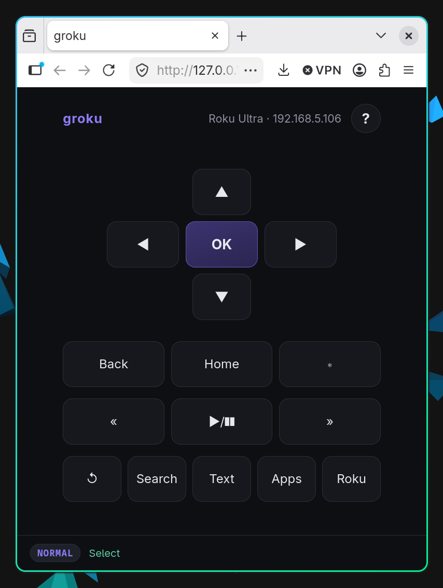
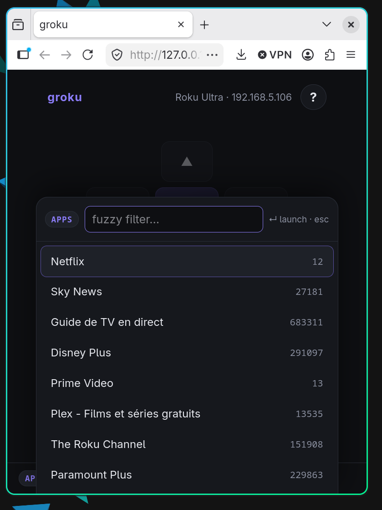
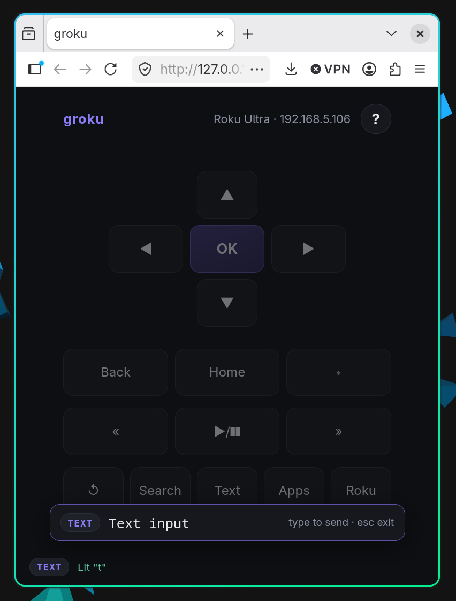
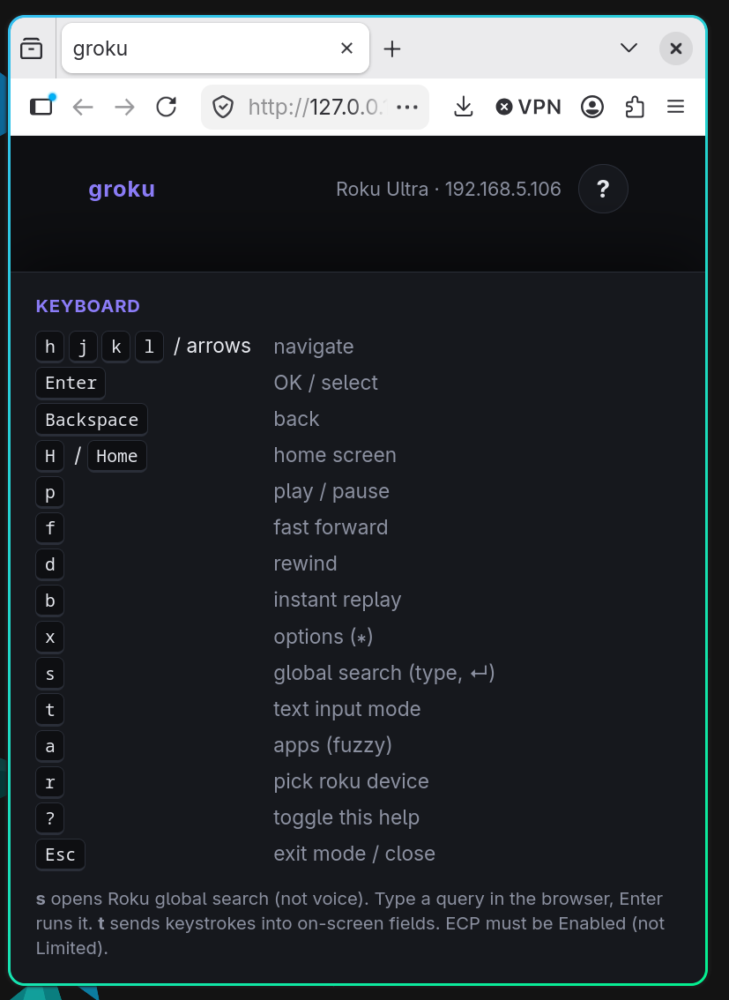

# groku

CLI + browser remote for your [Roku](https://www.roku.com/) — vim-style keys, global search, fuzzy app launcher.

<p align="center">
  
</p>

## Web UI

```bash
go run . serve
# open http://127.0.0.1:8080
```

```bash
go run . serve -addr :9090
go run . serve -roku http://192.168.1.50:8060/
```

### Keyboard

| Key | Action |
|-----|--------|
| `hjkl` / arrows | Navigate |
| `Enter` | OK / select |
| `Backspace` | Back |
| `H` / `Home` | Home screen |
| `p` | Play / pause |
| `f` / `d` | Fast forward / rewind |
| `b` | Instant replay |
| `x` | Options (∗) |
| `s` | Global search |
| `t` | Text input mode |
| `a` | Apps (fuzzy) |
| `r` | Pick Roku device |
| `?` | Toggle help |
| `Esc` | Exit mode |

### Modes

**Normal** — D-pad + transport, full keyboard map.

<p align="center">
  
</p>

**Search (`s`)** — type a query in the browser, Enter runs Roku global search (`/search/browse`). Not the voice-search button.

<p align="center">
  
</p>

**Text (`t`)** — each keystroke is sent to the focused on-screen field. Paste works.

<p align="center">
  
</p>

**Help (`?`)** — bottom sheet with every binding.

<p align="center">
  
</p>

Also: **`a`** fuzzy app launcher · **`r`** live SSDP device picker.

## Roku setting (required on OS 14.1+)

**Settings → System → Advanced system settings → Control by mobile apps → Network access → Enabled**

If this is “Limited”, discovery works but keypress returns 403.

## CLI

```bash
go build -o groku .
./groku discover
./groku home
./groku play
./groku search "The Bear"
./groku text "Breaking Bad"
./groku apps
./groku app "Netflix"
./groku serve
```

## Install

```bash
go install github.com/zankich/groku@latest
```

Or download a release binary.
